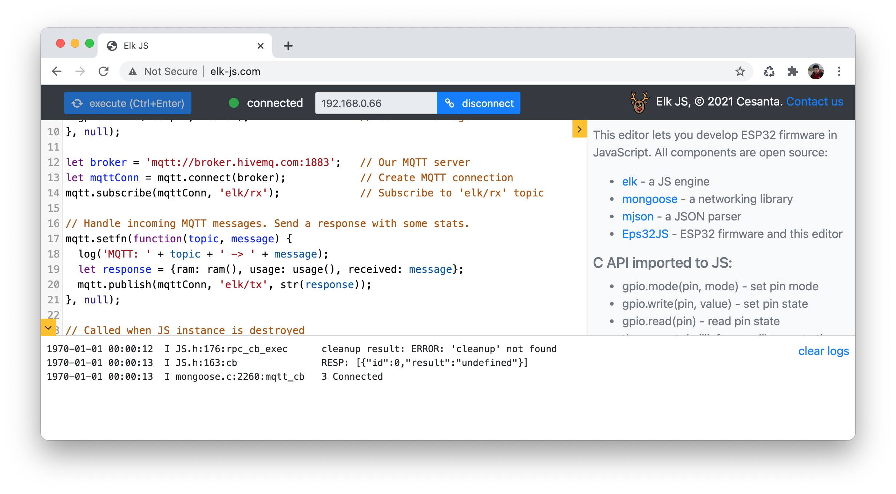

# Elk: a tiny JS engine for embedded systems

[](https://github.com/cesanta/elk/actions)
[](https://opensource.org/licenses/gpl-2.0.php)
[](https://codecov.io/gh/cesanta/elk)


Elk is a tiny embeddable JavaScript engine that implements a small but usable
subset of ES6. It is designed for microcontroller development. Instead of
writing firmware code in C/C++, Elk allows to develop in JavaScript. 
Another use case is providing customers with a secure, protected scripting
environment for product customisation.

Elk features include:

- Cross platform. Works anywhere from 8-bit microcontrollers to 64-bit servers
- Zero dependencies. Builds cleanly by ISO C or ISO C++ compilers
- Easy to embed: just copy `elk.c` and `elk.h` to your source tree
- Very small and simple embedding API
- Can call native C/C++ functions from JavaScript and vice versa
- Does not use malloc. Operates with a given memory buffer only
- Small footprint: about 20KB on flash/disk, about 100 bytes RAM for core VM
- No bytecode. Interprets JS code directly

Below is a demonstration on a classic Arduino Nano board which has
2K RAM and 30K flash (see [full sketch](examples/BlinkyJS/BlinkyJS.ino)):


## JavaScript on ESP32

The [Esp32JS](examples/Esp32JS) Arduino sketch is an example of Elk integration
with ESP32. Flash this sketch on your ESP32 board, go to http://elk-js.com,
and get a JavaScript development environment instantly! Reloading your script
takes a fraction of a second - compare that with a regular reflashing..
Here how it looks like:



The example JS firmware implements:
- Blinks an LED periodically
- Connects to the [HiveMQ](http://www.hivemq.com/demos/websocket-client/)
  MQTT server
- Subscribes to the `elk/rx` topic
- When an MQTT message is received, sends some stats to the `elk/tx` topic:


That's screenshot is taken from the MQTT server which shows that we sent
a `hello JS!` message and received stats in response:


## Call JavaScript from C
```c
#include <stdio.h>
#include "elk.h"

int main(void) {
  char mem[200];
  struct js *js = js_create(mem, sizeof(mem));  // Create JS instance
  jsval_t v = js_eval(js, "1 + 2 * 3", ~0);     // Execute JS code
  printf("result: %s\n", js_str(js, v));        // result: 7
  return 0;
}
```

## Call C from JavaScript

This demonstrates how JS code can import and call existing C functions:

```c
#include <stdio.h>
#include "elk.h"

// C function that adds two numbers. Will be called from JS
jsval_t sum(struct js *js, jsval_t *args, int nargs) {
  if (nargs != 2) return js_err(js, "2 args expected");
  double a = js_getnum(args[0]);  // Fetch 1st arg
  double b = js_getnum(args[1]);  // Fetch 2nd arg
  return js_mknum(a + b);
}

int main(void) {
  char mem[200];
  struct js *js = js_create(mem, sizeof(mem));      // Create JS instance
  js_set(js, js_glob(js), "sum", js_mkfun(sum)));   // Import sum()
  jsval_t result = js_eval(js, "sum(3, 4);", ~0);   // Call sum
  printf("result: %s\n", js_str(js, result));       // result: 7
  return 0;
}
```

## Supported features

- Operations: all standard JS operations except:
   - `!=`, `==`. Use strict comparison `!==`, `===`
   - No computed member access `a[b]`
- Typeof: `typeof('a') === 'string'`
- While: `while (...) { ... }`
- Conditional: `if (...) ... else ...`
- Ternary operator `a ? b : c`
- Simple types: `let a, b, c = 12.3, d = 'a', e = null, f = true, g = false;`
- Functions: `let f = function(x, y) { return x + y; };`
- Objects: `let obj = {f: function(x) { return x * 2}}; obj.f(3);`
- Every statement must end with a semicolon `;`
- Strings are binary data chunks, not Unicode strings: `'Київ'.length === 8`

## Not supported features

- No `var`, no `const`. Use `let` (strict mode only)
- No `do`, `switch`, `for`. Use `while`
- No `=>` functions. Use `let f = function(...) {...};`
- No arrays, closures, prototypes, `this`, `new`, `delete`
- No standard library: no `Date`, `Regexp`, `Function`, `String`, `Number`

## Performance

Since Elk parses and interprets JS code on the fly, it is not meant to be
used in a performance-critical scenarios. For example, below are the numbers
for a simple loop code on a different architectures.

```javascript
let a = 0;        // 97 milliseconds on a 16Mhz 8-bit Atmega328P (Arduino Uno and alike)
while (a < 100)   // 16 milliseconds on a 48Mhz SAMD21
  a++;            //  5 milliseconds on a 133Mhz Raspberry RP2040
                  //  2 milliseconds on a 240Mhz ESP32
```

## Build options

Available preprocessor definitions:

| Name         | Default   | Description |
| ------------ | --------- | ----------- |
|`JS_EXPR_MAX` | 20        | Maximum tokens in expression. Expression evaluation function declares an on-stack array `jsval_t stk[JS_EXPR_MAX];`. Increase to allow very long expressions. Reduce to save C stack space. |
|`JS_DUMP`     | undefined | Define to enable `js_dump(struct js *)` function which prints JS memory internals to stdout |

Note: on ESP32 or ESP8266, compiled functions go into the `.text` ELF
section and subsequently into the IRAM MCU memory. It is possible to save
IRAM space by copying Elk code into the irom section before linking.
First, compile the object file, then rename `.text` section, e.g. for ESP32:

```sh
$ xtensa-esp32-elf-gcc $CFLAGS elk.c -c elk.tmp
$ xtensa-esp32-elf-objcopy --rename-section .text=.irom0.text elk.tmp elk.o
```

Note: Elk uses `snprintf()` standard function to format numbers (double).
On some architectures, for example AVR Arduino, that standard function does
not support float formatting - therefore printing numbers may output nothing
or `?` symbols.

## API reference

### js\_create()

```c
struct js *js_create(void *buf, size_t len);
```

Initialize JS engine in a given memory block. Elk will only use that memory
block to hold its runtime, and never use any extra memory.
Return: a non-`NULL` opaque pointer on success, or `NULL` when
`len` is too small. The minimum `len` is about 100 bytes.

The given memory buffer is laid out in the following way:
```
  | <-------------------------------- len ------------------------------> |
  | struct js, ~100 bytes  |   runtime vars    |    free memory           | 
```

### js\_eval()

```c
jsval_t js_eval(struct js *, const char *buf, size_t len);
```

Evaluate JS code in `buf`, `len` and return result of the evaluation.  During
the evaluation, Elk stores variables in the "runtime" memory section. When
`js_eval()` returns, Elk does not keep any reference to the evaluated code: all
strings, functions, etc, are copied to the runtime.

Important note: the returned result is valid only before the next call to
`js_eval()`. The reason is that `js_eval()` triggers a garbage collection.
A garbage collection is mark-and-sweep, run before every top-level statement
gets executed.

The runtime footprint is as follows:
- An empty object is 8 bytes
- Each object property is 16 bytes
- A string is 4 bytes + string length, aligned to 4 byte boundary
- A C stack usage is ~200 bytes per nested expression evaluation


### js\_str()

```c
const char *js_str(struct js *, jsval_t val);
```

Stringify JS value `val` and return a pointer to a 0-terminated result.
The string is allocated in the "free" memory section. If there is no
enough space there, an empty string is returned. The returned pointer
is valid until the next `js_eval()` call.

### js\_glob()

```c
jsval_t js_glob(struct js *);
```

Return global JS object, i.e. root namespace.

### js\_set()

```c
void js_set(struct js *, jsval_t obj, const char *key, jsval_t val);
```

Assign an attribute `key` in in object `obj` to value `val`.


### js\_mk\*()

```c
jsval_t js_mkval(int type);     // Create undef, null, true, false
jsval_t js_mkobj(struct js *);  // Create object
jsval_t js_mkstr(struct js *, const void *, size_t);    // Create string
jsval_t js_mknum(double);                               // Create number
jsval_t js_mkerr(struct js *js, const char *fmt, ...);  // Create error
jsval_t js_mkfun(jsval_t (*fn)(struct js *, int));      // Create func
```

Create JS values

### js\_get\*()

### js\_type()

```c
enum { JS_UNDEF, JS_NULL, JS_TRUE, JS_FALSE, JS_STR, JS_NUM, JS_ERR, JS_PRIV };
int js_type(jsval_t val);  // Return JS value type
```

Return type of the JS value.

## js\_checkargs()

```c
jsval_t js_checkargs(struct js *js, jsval_t *args, int nargs, const char *spec, ...);
```

A helper function that fetches JS arguments into C values, according to
`spec` type specification. Return `JS_ERR` on error, or `JS_UNDEF` on success.
Supported specifiers:
- `b` for `bool`
- `d` for `double`
- `i` for `char`, `short`, `int`, `long`, and corresponding unsigned variants
- `s` for `char *`
- `j` for `jsval_t`

Usage example - a C function that implements a JS function
`greater_than(number1, number2)`:

```c
jsval_t js_gt(struct js *js, jsval_t *args, int nargs) {
  double a, b;
  jsval_t res = js_checkargs(js, args, nargs, "dd", &a, &b);
  if (js_type(res) == JS_UNDEF) {
    res = js_mkval(a > b ? JS_TRUE : JS_FALSE);
  }
  return res;
}
```

## LICENSE

Dual license: AGPLv3 or commercial. For commercial licensing, technical support
and integration help, please contact us at https://cesanta.com/contact.html
